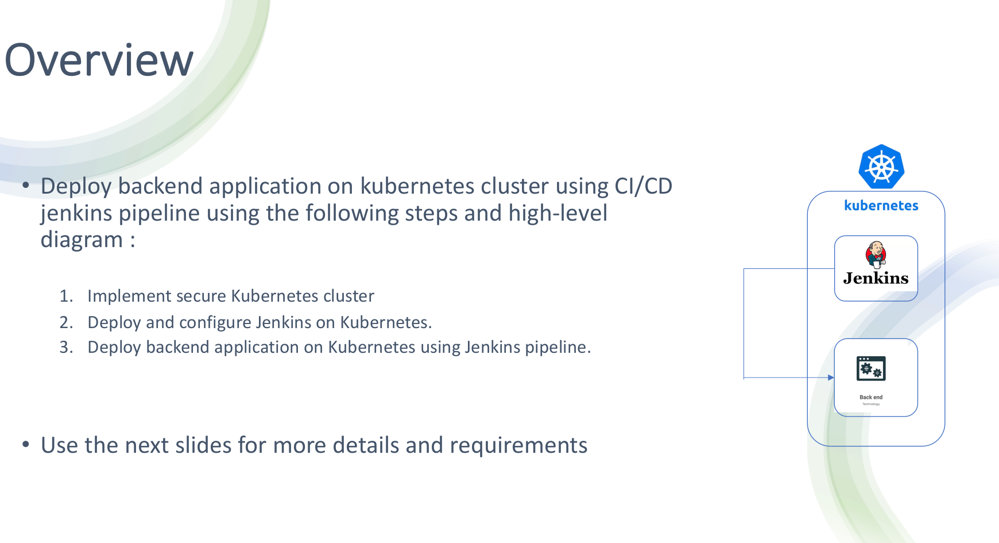
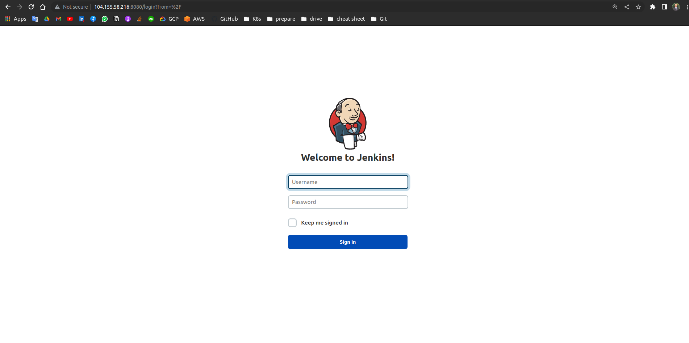
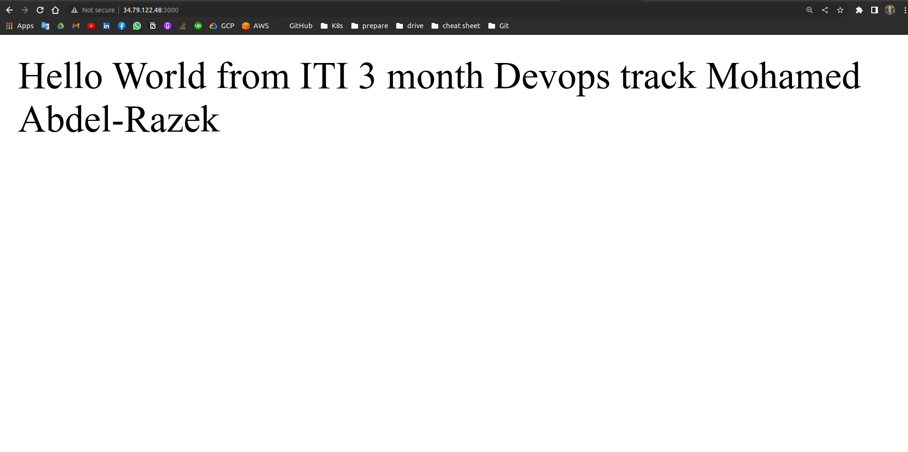

# Graduation Project



# Steps

## Build infrastructure using Terraform

 implement a private gke cluster on GCP only accessed by a private bastion instance 

 Create infrastructure and deployment process with terraform.

 Implement and configure  secure Kubernetes cluster on AWS/GCP using infrastructure as a code.    

```bash
terraform init 
terraform fmt 
terraform plan 
terraform apply --auto-approve
```

## Configure bastion-instance

Create  metadata to apply startups script to run commands to configure and 

- install gcloud
- install kubectl
- install open jdk
- install docker
- install git


Then, ssh to the instance and  generate ssh public and private key

```bash
ssh-keygen 
cat ~/.shh/id_rsa
```

Copy the private key to use it to run ansible play-book to create jenkins deployment

## Create Jenkins-server deployment

## Create VolumesYaml file

```yaml
apiVersion: storage.k8s.io/v1
kind: StorageClass
metadata:
  name: my-storage-class
provisioner: kubernetes.io/gce-pd
volumeBindingMode: WaitForFirstConsumer
allowVolumeExpansion: true
reclaimPolicy: Delete
parameters:
  type: pd-standard
  fstype: ext4
  replication-type: none

---
apiVersion: v1
kind: PersistentVolumeClaim
metadata:
  name: jenkins-pv-claim
spec:
  storageClassName: my-storage-class
  accessModes:
     - ReadWriteOnce
  resources:
    requests:
      storage: 10Gi
```

# Create jenkins deployment file

```yaml
apiVersion: apps/v1
kind: Deployment
metadata:
  name: jenkins
  namespace: jenkins
spec:
  replicas: 1
  selector:
    matchLabels:
      app: jenkins-3brazik
  template:
    metadata:
      labels:
        app: jenkins-3brazik
    spec:
      containers:
        - name: jenkins
          image: jenkins/jenkins:lts
          ports:
            - name: httpport
              containerPort: 8080
            - name: jnlpport
              containerPort: 50000
          volumeMounts:
            - name: jenkins-data
              mountPath: /var/jenkins_home         
      volumes:
        - name: jenkins-data
          persistentVolumeClaim:
              claimName: jenkins-pv-claim
```

# Create load-balancer

```yaml
apiVersion: v1
kind: Service
metadata:
  name: load-balancer
  namespace: jenkins
spec:
  type: LoadBalancer
  selector:
    app: jenkins-3brazik
  ports:
    - protocol: TCP
      port: 8080
      targetPort: 8080
```

# Then, Run Ansible play-book

```yaml
- hosts: all
  remote_user: m3brazik
  become: true
  tasks: 
      - name: auth with the cluster
        shell: gcloud container clusters get-credentials private-standerd-gke-cluster --zone europe-west1-b
      - name: copy files
        copy:
          src: ./k8s_files/.
          dest: kube_files/.
          
      - name : Create namespace
        shell: kubectl create -f /home/m3brazik/kube_files/namespace.yaml  
      
      - name: go to jenkins namespace
        shell: kubectl config set-context --current --namespace=jenkins

      - name: create service account 
        shell: kubectl create -f /home/m3brazik/kube_files/serviceAccount.yaml  

      - name : Create volume 
        shell: kubectl create -f /home/m3brazik/kube_files/volume.yaml
        
      - name : Create Deployment
        shell: kubectl create -f /home/m3brazik/kube_files/deployment.yaml

      - name : Create load-balancer
        shell: kubectl create -f /home/m3brazik/kube_files/loadbalancer.yaml
      
      - name : sleep untill load balancer getting ready
        pause:
            minutes: 2
            
      - name: auth with the cluster
        shell: gcloud container clusters get-credentials private-standerd-gke-cluster --zone europe-west1-b      
        
      - name: Get jenkins loadbalancer ip 
        shell: 'kubectl get svc -n jenkins | grep load-balancer'
        register: ip 

      - debug:
          var: ip.stdout_lines 

      - name: Get jenkins password
        shell: 'kubectl exec  $(kubectl get pods -n jenkins | grep jenkins- | cut -d" " -f1) -n jenkins -- cat /var/jenkins_home/secrets/initialAdminPassword '
        register: password

      - debug:
          var: password.stdout_lines

```

```bash

ansible-playbook -i inventory  play-book.yaml
```

## Then, get the load balancer  IP



# After creating jenkins server we need to create Docker file to build our app image.

```docker
FROM node:12
COPY nodeapp /nodeapp
WORKDIR /nodeapp
RUN npm install
CMD ["node", "/nodeapp/app.js"]
```

## Then we create our app deployment and load-balancer yaml file

```yaml
apiVersion: apps/v1
kind: Deployment
metadata:
  name: node-deploy
  namespace: application
spec:
  replicas: 1
  selector:
    matchLabels:
      app: nodejs
  template:
    metadata:
      labels:
        app: nodejs
    spec:
      containers:
        - name: node-container
          image: 3brazik/app_img
          ports:
            - name: http
              containerPort: 3000

---
apiVersion: v1
kind: Service
metadata:
  name: app-load-balancer
  namespace: application
spec:
  type: LoadBalancer
  selector:
    app: nodejs
  ports:
    - protocol: TCP
      port: 3000
      targetPort: 3000
```

# Then, configure the bastion instance as a slave

go to manage jenkins > Manage nodes and cloud > New Node


## Then, create jenkins pipeline script

```groovy
pipeline {
    agent { label'slave' }

    stages {
        stage('Build') {
            steps {
                // Get some code from a GitHub repository
                git 'https://github.com/3brazik/newww.git'

            }
        }
        stage('ci') {
            steps {
                    withCredentials([usernamePassword(credentialsId: 'dockerhub', usernameVariable: 'USERNAME', passwordVariable: 'PASSWORD')]){

                    sh "docker login -u ${USERNAME} -p ${PASSWORD}"
                    sh "docker build .  -t 3brazik/app_img"
                    sh "docker push 3brazik/app_img"
                }
            }    
        }
         stage ('deploy app'){
            steps {
                sh """
                kubectl apply -f app.yaml
                echo done
            """
            }       
        }
    }
}
```

## Build pipeline and go to console logs to see the results


# Then, ssh to the instance and get the IP

